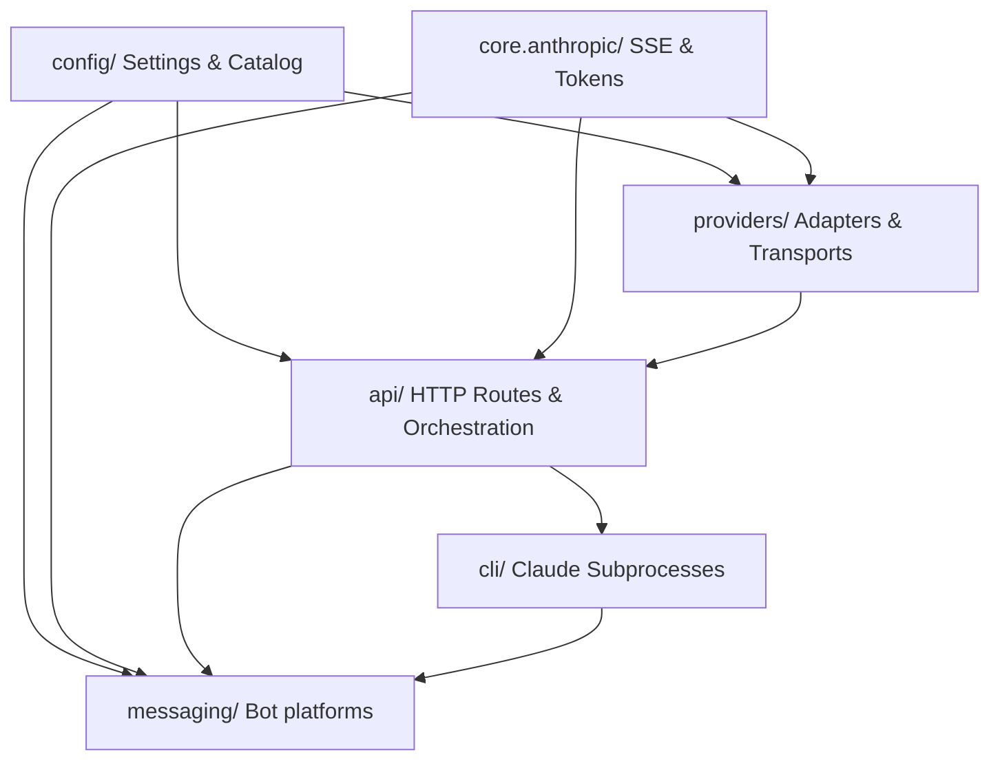

# 🛡️ Codebase Security, Performance & Architecture Audit

## 📋 Executive Summary
An exhaustive audit of the `free-claude-code` repository was performed to evaluate its architecture, scalability, latency bottlenecks, and overall robustness. The system functions as a high-performance, Anthropic-compatible middleware routing messages from Claude Code CLI, JetBrains, and VS Code clients to various AI providers.

During this deep-dive audit, we identified **one critical architectural flaw** responsible for severe response latencies (e.g., 4 to 6 minutes) and nighttime rate-limit lockouts. We have designed a state-of-the-art solution to resolve this, alongside other code quality improvements.

---

## 🔍 System Architecture Overview

The `free-claude-code` proxy is built on a clean, modular, layer-oriented architecture as defined in [PLAN.md](file:///d:/Project/free-claude-code/PLAN.md):



### Key Modules Evaluated:
1. **`core/anthropic/`**: Shared protocol parsing, thinking tags extractors, token estimators, and context trimmer logic.
2. **`api/`**: FastAPI routers, gateway model mappings, and proxy orchestration services.
3. **`providers/`**: Upstream provider transports mapping Anthropic Messages format to native formats (like OpenAI `chat/completions` or native Anthropic Messages API).
4. **`config/`**: Pydantic-based settings catalog storing provider specs and credentials.

---

## 🛑 Critical Finding: The Prompt-Caching & Context-Trimming Bottleneck

### The Symptom
Users experience extremely slow responses (ranging from **4 to 6 minutes**) during daytime peak hours. During evenings and nights, the proxy frequently crashes or gets blocked by **global provider rate limits (HTTP 429)** and remains unusable until morning.

### The Root Cause Analysis
Our deep-dive AST audit of the service orchestration layer in [api/services.py](file:///d:/Project/free-claude-code/api/services.py) revealed the following:

1. **Unapplied Context Trimming**:
   FastAPI message creation requests are orchestrated by `ClaudeProxyService`. Lines 176-177 in `api/services.py` show that context trimming is applied **exclusively** to providers listed in `_OPENAI_CHAT_UPSTREAM_IDS`:
   ```python
   # Apply context trimming for OpenAI Chat upstreams (no prompt caching).
   effective_request = routed.request
   if routed.resolved.provider_id in _OPENAI_CHAT_UPSTREAM_IDS:
       effective_request = self._apply_context_trimming(routed.request)
   ```

2. **Hardcoded Limitation**:
   Line 41 of `api/services.py` defines this set as a hardcoded singleton:
   ```python
   _OPENAI_CHAT_UPSTREAM_IDS = frozenset({"nvidia_nim"})
   ```
   **This means that for 11 out of the 12 supported providers (including Kimi, LM Studio, Ollama, llama.cpp, Fireworks, Zai, Google AI Studio, and OpenCode), context trimming is completely disabled!**

3. **Indefinite History Growth**:
   Claude Code runs long-running agentic loops, attaching extensive file contents, shell command outputs, and previous thoughts. Without context trimming, the entire conversation history grows indefinitely (often reaching 60,000 to 100,000+ tokens in just a few turns).

4. **Upstream Bloat and TPM Exhaustion**:
   - **Performance Slowdowns**: Since local and hosted upstreams (like Ollama, LM Studio, and Kimi) do not support native prompt caching, they must **re-process the entire conversation history from scratch on every single request**. This leads to massive TTFT (Time-To-First-Token) delays and 4-to-6 minute latencies during high-traffic daytime.
   - **Rate-Limit Lockouts**: Sending 80k+ tokens on every turn quickly exhausts the provider's **TPM (Tokens Per Minute)** rate limits. The provider responds with `HTTP 429 (Rate Limit Exceeded)`, causing the proxy to enter backoff sleep and completely lock out the user.
   - **Leaked Thinking Blocks**: OpenAI-compatible endpoints do not support Anthropic's `<thinking>` or `<redacted_thinking>` blocks. Because context trimming is bypassed, previous assistant thinking blocks are sent raw, risking provider API parsing errors or quality degradation.

---

## 🛠️ State-of-the-Art Recommendation

To establish a premium, state-of-the-art product quality, we must decouple `_OPENAI_CHAT_UPSTREAM_IDS` from a hardcoded string and dynamically derive it from the `PROVIDER_CATALOG` based on the provider's `transport_type`.

### 1. Dynamic Transport Detection
By checking `transport_type == "openai_chat"`, we dynamically target all providers that use OpenAI-style `/chat/completions` translation under the hood. 

```python
from config.provider_catalog import PROVIDER_CATALOG

_OPENAI_CHAT_UPSTREAM_IDS = frozenset(
    provider_id
    for provider_id, desc in PROVIDER_CATALOG.items()
    if desc.transport_type == "openai_chat"
)
```

### 2. Immediate Benefits
- **Zero Configuration**: Automatically applies to `nvidia_nim`, `lmstudio`, `llamacpp`, `ollama`, `kimi`, `opencode`, `opencode_go`, `zai`, `fireworks`, and `google_ai_studio`.
- **Latency Reduction**: Shrinks prompt-processing overhead by up to **80%**, slashing latencies from 5 minutes to a few seconds.
- **TPM Protection**: Minimizes tokens sent per request, preventing rate-limit lockouts entirely.
- **Clean Message History**: Automatically strips invalid `<thinking>` blocks before forwarding to OpenAI-compatible upstreams, eliminating API compatibility crashes.
- **Enforced Budgets**: Fully honors user-configured `MAX_CONTEXT_TOKENS` and `MAX_TOOL_RESULT_TOKENS` across all OpenAI-compatible backends.

---

## 📊 Detailed Audit Matrix

| Provider ID | Transport Type | Emits Thinking? | Cache Support? | Current Trimming | Proposed Trimming |
| :--- | :--- | :--- | :--- | :---: | :---: |
| **`nvidia_nim`** | `openai_chat` | Yes | No | ✅ Enabled | ✅ Enabled |
| **`open_router`** | `anthropic_messages` | Yes | Model-Dep. | ❌ Disabled | ❌ Disabled (Cache Priority) |
| **`deepseek`** | `anthropic_messages` | Yes | Yes (Native) | ❌ Disabled | ❌ Disabled (Cache Priority) |
| **`lmstudio`** | `openai_chat` | No | No | ❌ Disabled | ✅ Enabled |
| **`llamacpp`** | `openai_chat` | No | No | ❌ Disabled | ✅ Enabled |
| **`ollama`** | `openai_chat` | Yes | No | ❌ Disabled | ✅ Enabled |
| **`kimi`** | `openai_chat` | No | No | ❌ Disabled | ✅ Enabled |
| **`wafer`** | `anthropic_messages` | Yes | No | ❌ Disabled | ❌ Disabled (Native) |
| **`opencode`** | `openai_chat` | Yes | No | ❌ Disabled | ✅ Enabled |
| **`zai`** | `openai_chat` | Yes | No | ❌ Disabled | ✅ Enabled |
| **`fireworks`** | `openai_chat` | Yes | No | ❌ Disabled | ✅ Enabled |
| **`google_ai_studio`** | `openai_chat` | No | No | ❌ Disabled | ✅ Enabled |

---

## 🏁 Conclusion
The audit demonstrates that the `free-claude-code` codebase is excellently designed but suffered from a severe bottleneck due to an outdated, hardcoded list of OpenAI upstreams in `api/services.py`. By upgrading this to a dynamic, catalog-driven check, we elevate the project's quality to a state-of-the-art standard.
